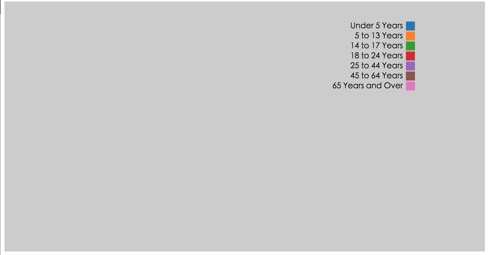
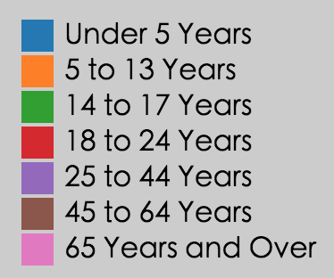

# Legend

Legend component documents.

## Import

```js
import {
  Legend as Legend
} from 'react-d3-core';
```

## Settings props

You can customize `Legend` component using the following properties.

- width
- height
- margins
- legendClassName
- legendPosition
- legendOffset
- chartSeries

### width

**default as `960`**

`width` prop is the width of the parent `svg` that wrap the legend component.

### height

**default as `500`**

`height` prop is the height of the parent `svg` that wrap the legend component.

### margins

**default as `{top: 20, right: 50, bottom: 20, left: 50}`**

`margins` prop is the margins of the parent `svg` that wrap the legend component.

### legendClassName

**default as `react-d3-core__legend`**

`legendClassName` is the setting that set the class of the `<g class="your-legend-class-name">`

### legendPosition

**default as `left`**

`legendPosition` can be set as `left` or `right`, which will automatically set your legend to the left or right of your chart.

#### legendPosition = 'left'


#### legendPosition = 'right'



### legendOffset

**default as `90`**

`legendOffset` set the offset of `Legend` component.

### chartSeries

**must be a array, with objects including keys of  field, name, color**

This will set the Legend field, name, and color.

For instance:

```js
[
  {
    field: 'Under 5 Years',
    name: 'Under 5 Years',
    color: '#1f77b4'
  },
  {
    field: '5 to 13 Years',
    name: '5 to 13 Years',
    color: '#ff7f0e'
  },
  {
    field: '14 to 17 Years',
    name: '14 to 17 Years',
    color: '#2ca02c'
  },
  {
    field: '18 to 24 Years',
    name: '18 to 24 Years',
    color: '#d62728'
  },
  {
    field: '25 to 44 Years',
    name: '25 to 44 Years',
    color: '#9467bd'
  },
  {
    field: '45 to 64 Years',
    name: '45 to 64 Years',
    color: '#8c564b'
  },
  {
    field: '65 Years and Over',
    name: '65 Years and Over',
    color: '#e377c2'
  },
]
```

is the `chartSeries` of the legend shown below.


